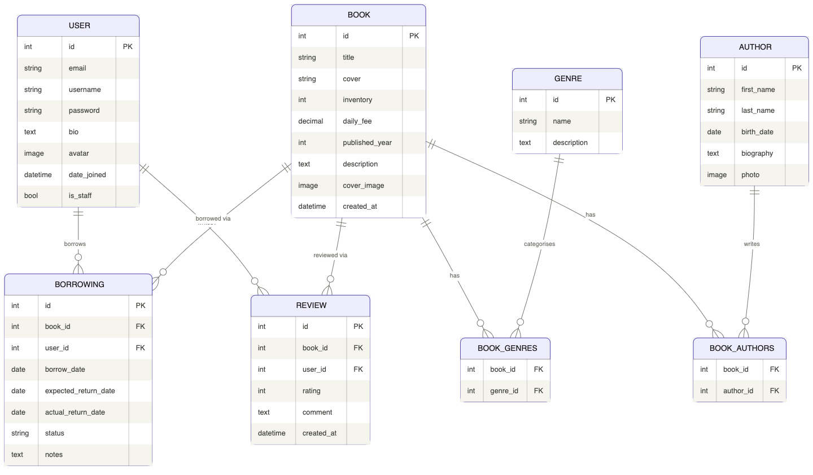

# 📚 Library Management API

A RESTful API for managing a library — books, authors, genres, borrowings, and user reviews.
Built with **Django REST Framework**, **JWT authentication**, **PostgreSQL**, and **Docker**.

---

## 🗂 DB Structure



---

## ✨ Features

- **JWT Authentication** — secure access via Bearer token
- **Admin panel** — `/admin/`
- **Swagger UI** — interactive docs at `/api/doc/swagger/`
- **ReDoc** — alternative docs at `/api/doc/redoc/`
- **Books** — full CRUD (admin only for write), with cover image upload
- **Authors** — full CRUD with photo upload
- **Genres** — manage book categories
- **Borrowings** — borrow a book, track return date, auto-inventory management
- **Return endpoint** — `POST /api/library/borrowings/{id}/return/`
- **Active borrowings** — `GET /api/library/borrowings/active/`
- **Overdue detection** — automatic fine calculation (2× daily fee per overdue day)
- **Reviews** — authenticated users can rate and review books (1–5 stars)
- **Filtering** — books by genre, author, cover type, availability, price range; borrowings by status/user
- **Search** — books by title, author, description
- **Ordering** — books by fee, year, title; borrowings by date, status

---

## 🚀 Installing using GitHub (local)

### Prerequisites
- Python 3.11+
- PostgreSQL installed and running

```bash
git clone https://github.com/<your-username>/library-api.git
cd library-api

python -m venv venv
source venv/bin/activate          # Windows: venv\Scripts\activate

pip install -r requirements.txt
```

Copy and fill in environment variables:
```bash
cp .env.sample .env
# Edit .env with your DB credentials and SECRET_KEY
```

```bash
python manage.py migrate
python manage.py createsuperuser
python manage.py loaddata library_fixture.json   # optional: load sample data
python manage.py runserver
```

---

## 🐳 Run with Docker

> Docker and Docker Compose must be installed.

```bash
git clone https://github.com/<your-username>/library-api.git
cd library-api

cp .env.sample .env
# Edit .env — set SECRET_KEY, DB credentials

docker-compose build
docker-compose up
```

The API will be available at **http://localhost:8000**

To load sample data inside Docker:
```bash
docker-compose exec app python manage.py loaddata library_fixture.json
```

---

## 🔑 Getting Access

1. **Register** a new user:
   ```
   POST /api/user/register/
   {
     "email": "user@example.com",
     "username": "myuser",
     "password": "securepass123",
     "password2": "securepass123"
   }
   ```

2. **Obtain JWT token**:
   ```
   POST /api/user/token/
   {
     "email": "user@example.com",
     "password": "securepass123"
   }
   ```
   Returns `access` and `refresh` tokens.

3. **Use the token** in all subsequent requests:
   ```
   Authorization: Bearer <access_token>
   ```

4. **Refresh token** when expired:
   ```
   POST /api/user/token/refresh/
   { "refresh": "<refresh_token>" }
   ```

---

## 📡 API Endpoints

### User
| Method | Endpoint | Description |
|--------|----------|-------------|
| POST | `/api/user/register/` | Register a new user |
| POST | `/api/user/token/` | Obtain JWT tokens |
| POST | `/api/user/token/refresh/` | Refresh access token |
| GET/PUT/PATCH | `/api/user/me/` | View / update own profile |
| POST | `/api/user/change-password/` | Change password |

### Genres
| Method | Endpoint | Description |
|--------|----------|-------------|
| GET | `/api/library/genres/` | List all genres |
| POST | `/api/library/genres/` | Create genre (admin) |
| GET/PUT/PATCH/DELETE | `/api/library/genres/{id}/` | Manage genre (admin) |

### Authors
| Method | Endpoint | Description |
|--------|----------|-------------|
| GET | `/api/library/authors/` | List all authors |
| POST | `/api/library/authors/` | Create author (admin) |
| GET/PUT/PATCH/DELETE | `/api/library/authors/{id}/` | Manage author (admin) |

### Books
| Method | Endpoint | Description |
|--------|----------|-------------|
| GET | `/api/library/books/` | List books (filterable) |
| POST | `/api/library/books/` | Create book (admin) |
| GET/PUT/PATCH/DELETE | `/api/library/books/{id}/` | Manage book (admin) |
| GET | `/api/library/books/{id}/reviews/` | List reviews for a book |

**Book filters:** `?title=`, `?genres=`, `?authors=`, `?cover=HARD/SOFT`, `?available=true`, `?min_fee=`, `?max_fee=`, `?published_year=`

### Borrowings
| Method | Endpoint | Description |
|--------|----------|-------------|
| GET | `/api/library/borrowings/` | List borrowings (own; admin sees all) |
| POST | `/api/library/borrowings/` | Borrow a book |
| GET | `/api/library/borrowings/{id}/` | Borrowing detail |
| POST | `/api/library/borrowings/{id}/return/` | Return a book |
| GET | `/api/library/borrowings/active/` | List active borrowings |

**Borrowing filters:** `?status=ACTIVE/RETURNED/OVERDUE`, `?is_active=true`, `?book=`, `?user=` (admin)

### Reviews
| Method | Endpoint | Description |
|--------|----------|-------------|
| GET | `/api/library/reviews/` | List own reviews |
| POST | `/api/library/reviews/` | Create review (1 per book) |
| GET | `/api/library/reviews/{id}/` | Review detail |
| DELETE | `/api/library/reviews/{id}/` | Delete own review |

---

## 📸 Screenshots

> Add screenshots of your Browsable API / Swagger UI here after running the project.

- `docs/swagger_books.png` — Book list with filters
- `docs/swagger_borrowings.png` — Borrowings endpoint
- `docs/swagger_auth.png` — JWT token endpoints
- `docs/admin_panel.png` — Django admin panel

---

## 🛠 Tech Stack

- **Python 3.11**
- **Django 4.2**
- **Django REST Framework 3.14**
- **SimpleJWT** — JWT auth
- **drf-spectacular** — OpenAPI 3 schema & Swagger UI
- **django-filter** — advanced filtering
- **PostgreSQL 14**
- **Docker / Docker Compose**
